# Expo React Native FinTech

This is a React Native FinTech clone using Clerk for user authentication with OTP. This app was inspired by the Revolut app.

## Features

- [Expo Router](https://docs.expo.dev/routing/introduction/) file-based navigation
- [SMS OTP](https://clerk.com/docs/custom-flows/email-sms-otp?utm_source=sponsorship&utm_medium=github&utm_campaign=simong&utm_content=rn-fintech) Auth with Clerk
- [Reanimated](https://docs.swmansion.com/react-native-reanimated/) 3 for animations
- [Gesture Handler](https://docs.swmansion.com/react-native-gesture-handler/) for gestures
- [Zustand](https://zustand-demo.pmnd.rs/) and [MMKV](https://github.com/mrousavy/react-native-mmkv) for state management
- [Victory Native XL](https://commerce.nearform.com/open-source/victory-native) for charts
- [Zeego](https://zeego.dev/start) for native menus
- [Coingecko API](https://www.coingecko.com/en/api) for crypto prices
- [REST Countries API](https://restcountries.com/) for countries

## Screenshots

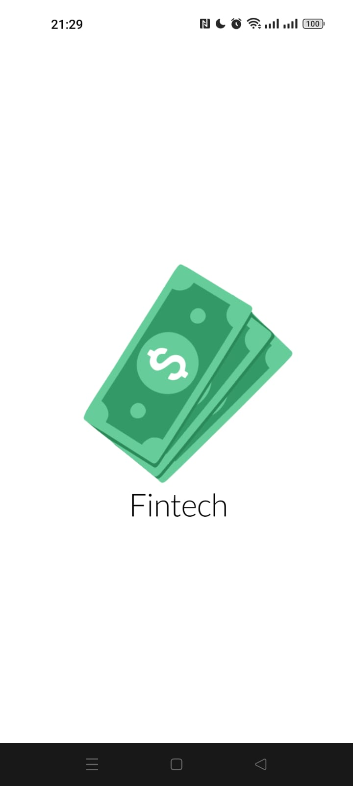
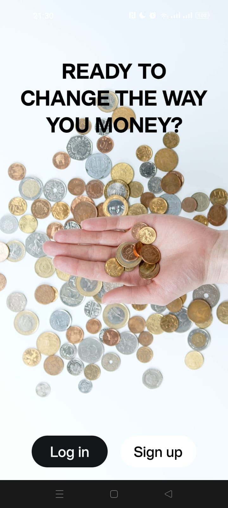
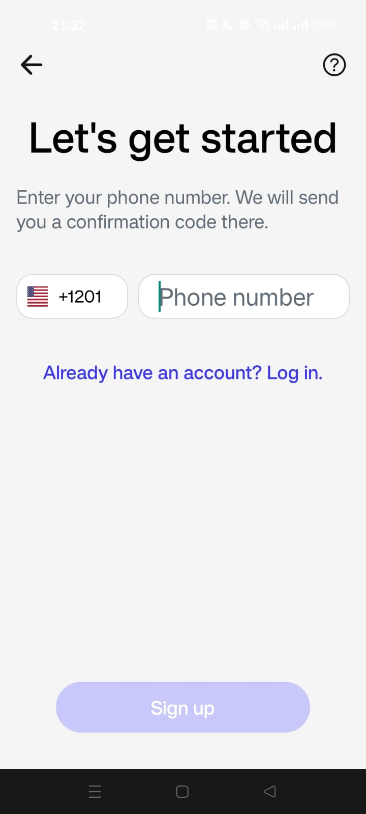
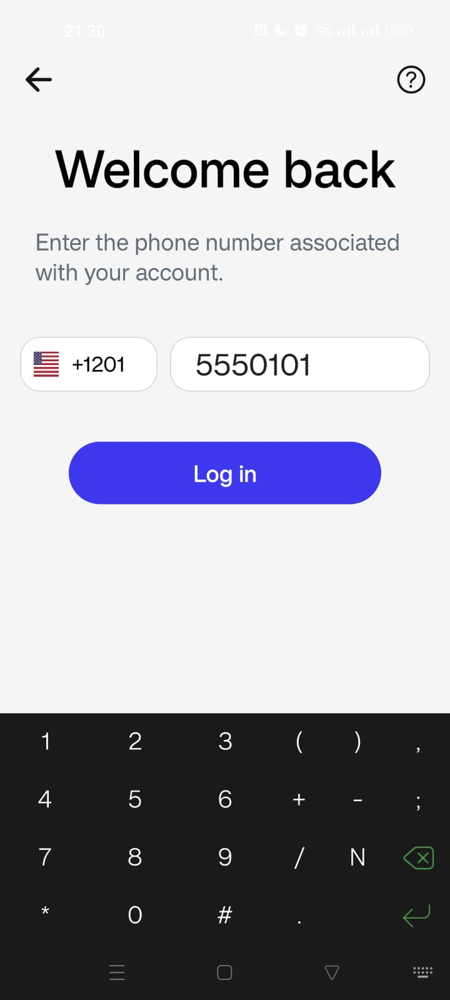
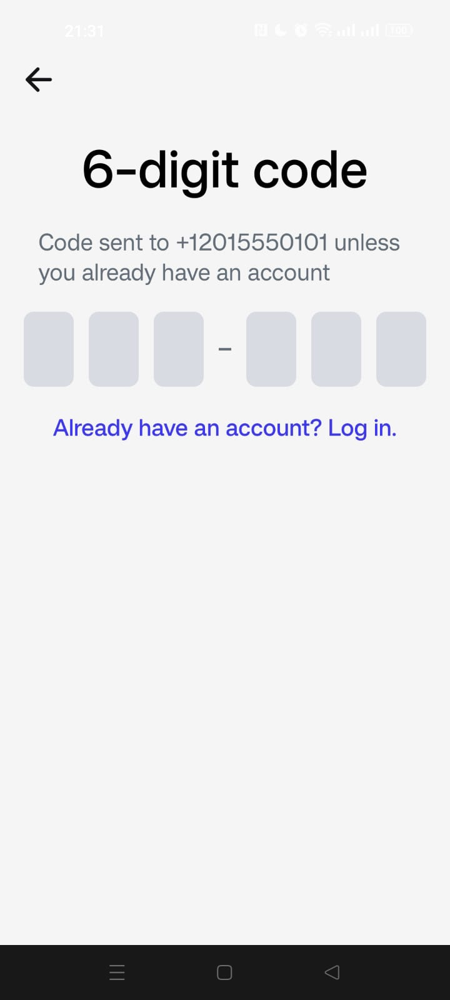
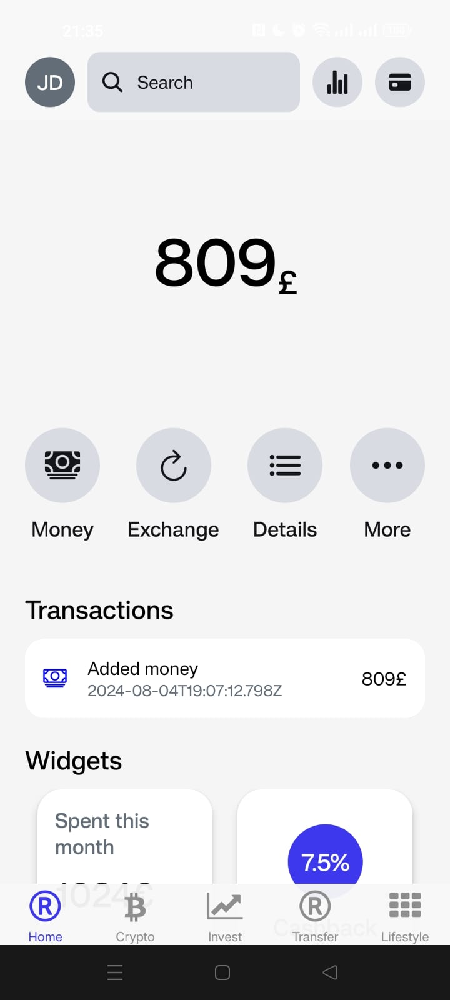
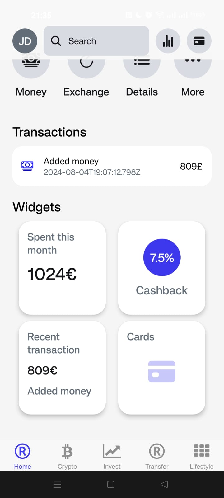
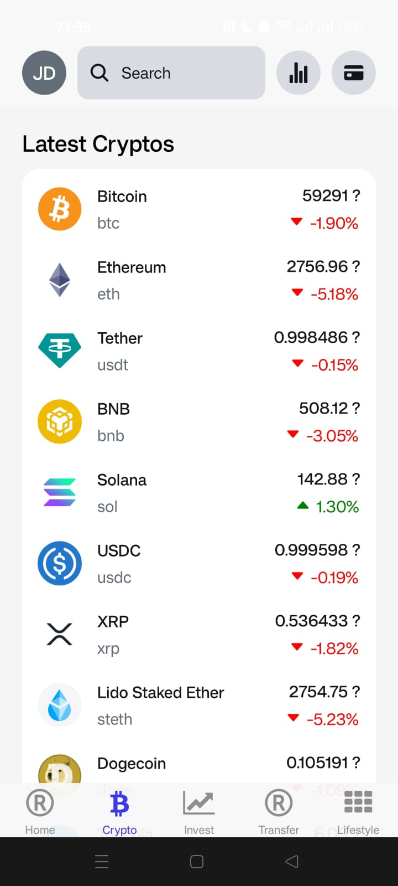
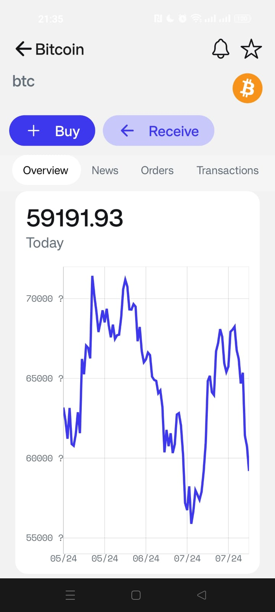
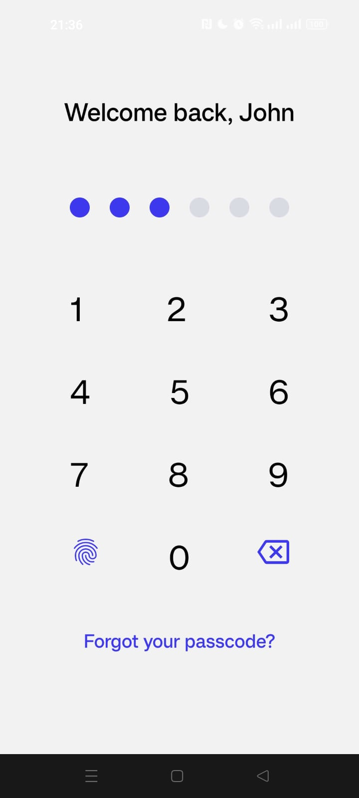
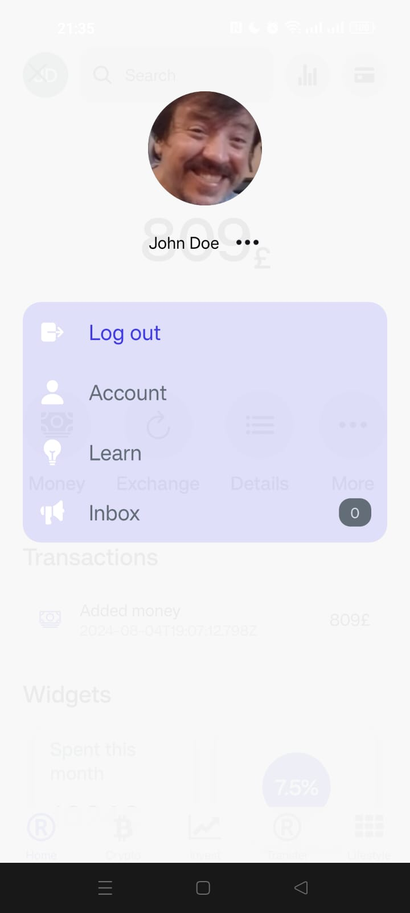

## Development Background

This application was developed as part of a YouTube course taught by Simmon Grimm, providing practical experience in building a feature-rich FinTech app using React Native and related technologies.
